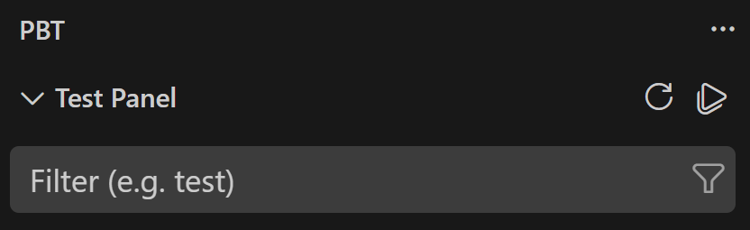
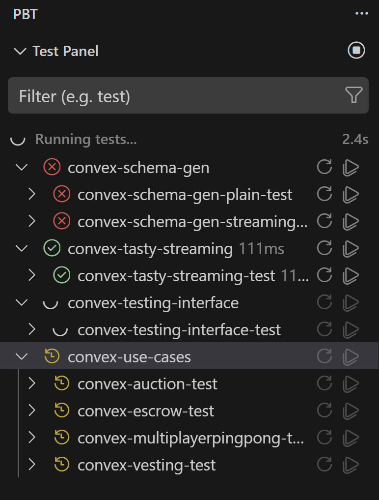
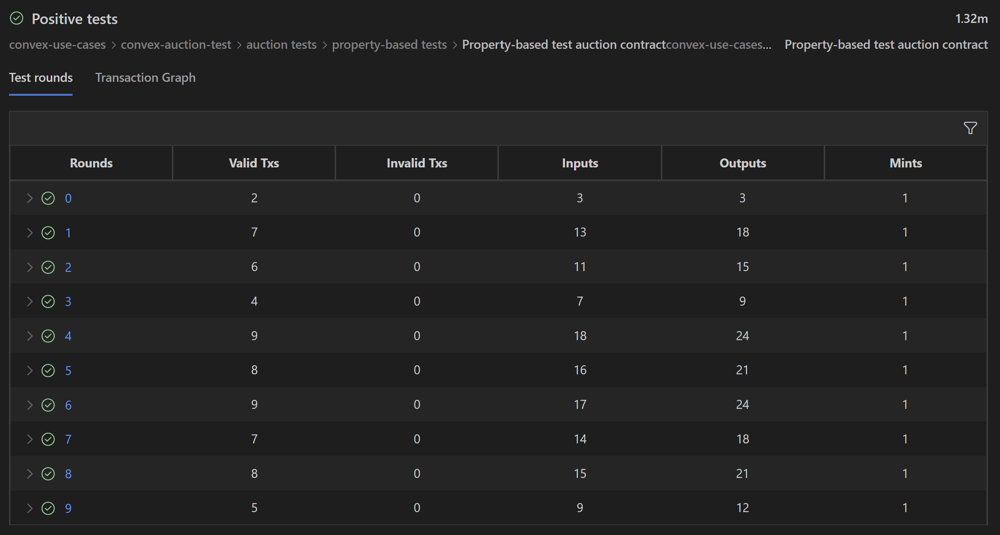
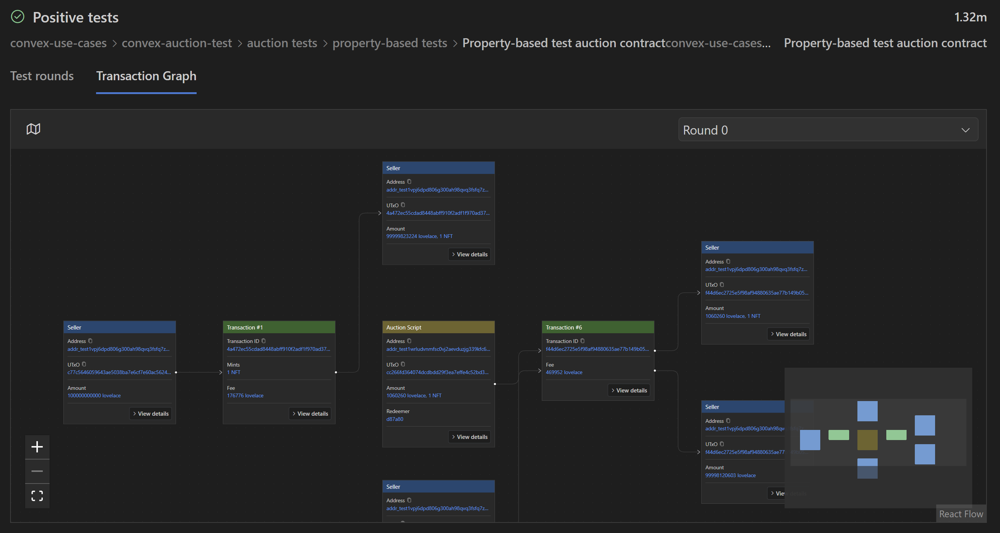
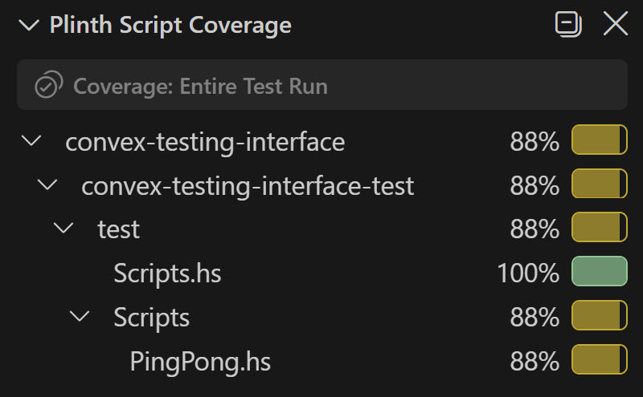
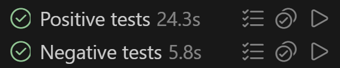

<p align="center">
  
</p>

<h1 align="center">PBT for VS Code</h1>

<p align="center">
  Run, explore, and debug property-based tests and threat models for Cardano smart contracts written in Plinth.
</p>

- [Overview](#overview)
- [Requirements](#requirements)
- [Getting started](#getting-started)
  - [1. Install the extension](#1-install-the-extension)
  - [2. Open your project](#2-open-your-project)
  - [3. Open the PBT sidebar](#3-open-the-pbt-sidebar)
  - [4. Choose an execution mode](#4-choose-an-execution-mode)
  - [5. Set the number of test rounds](#5-set-the-number-of-test-rounds)
  - [6. Run your tests](#6-run-your-tests)
  - [7. Read the results](#7-read-the-results)
  - [8. Read the coverage](#8-read-the-coverage)
  - [9. Refresh after changing your tests](#9-refresh-after-changing-your-tests)
- [Troubleshooting](#troubleshooting)
- [Get Support](#get-support)
- [Contributions](#contributions)
- [License](#license)


## Overview

Property-based testing finds the edge case you would never have thought to write a test for. PBT brings the entire property-based testing process into one seamless user interface.

- **Nothing to configure:** Write your test suites in your Plinth project as you normally would and PBT picks them up on its own. There is nothing to register on the extension side, no paths to point at, and no settings to keep in sync as the project grows.
- **One place to drive everything:** Run a whole package, a single suite, or one test, and see the results of all the tests in a single view.
- **Round-level results:** See the status of every test at a glance, then open a test's result views to inspect the status of each of its rounds and the transactions produced by each round.
- **Transactions you can actually read:** An interactive graph showing every transaction, input, and output from a test in a single view.
- **Coverage where you are already looking:** See how much of each Plinth script a test run exercised, both as percentages in the sidebar and as highlighting on the lines of the script itself.

## Requirements

**Docker or Nix.** PBT runs your test suites using either Docker or Nix. you **MUST HAVE** one of them installed and working in order for the extension to run.

**Docker**: install Docker Desktop or Docker Engine and make sure it is actually running. 

**Nix**: install Nix. 

Whichever one you install is the one you tell PBT to use later, in [step 4](#4-choose-an-execution-mode).

**A working sc-testing-tools setup.** This extension is the front end. It does not run your tests itself. It launches your test suites and then reads the stream of events they report back, which is what fills in the test tree, the round results, the transaction graphs, and the coverage numbers. All of that comes from [sc-testing-tools](https://github.com/input-output-hk/sc-testing-tools), the testing backend PBT is built on top of.

If sc-testing-tools is not installed and working on your machine, PBT has nothing to run and nothing to display. To install the backend, follow the install instructions in the [sc-testing-tools README](https://github.com/input-output-hk/sc-testing-tools).

## Getting started

### 1. Install the extension

PBT is on the VS Code Marketplace. Open the Extensions view, search for `pbt`, and install the one published by **IOG**.


You can also install it from its [Marketplace page](https://marketplace.visualstudio.com/items?itemName=IOG.pbt-extension) in a browser, or from the command line:

```bash
code --install-extension IOG.pbt-extension
```

**Building from source.** If you would rather run a development build, clone the repository and compile it:

```bash
git clone https://github.com/input-output-hk/sc-testing-tools-vs-extension.git
cd sc-testing-tools-vs-extension
npm install
npm run compile
```

`npm run compile` builds the extension, the server, and the webview UI. Then press <kbd>F5</kbd> to launch a VS Code window with PBT loaded.


### 2. Open your project

PBT works on a Plinth project folder, so the first step is having that folder open in VS Code. Either open a workspace that already contains the folder, or open the folder in the workspace you are already in.

From there, PBT scans on its own. There is no command to run and nothing to configure.

The scan looks for `.cabal` files anywhere in your workspace, reads the test-suites declared in each one, and builds the test tree from what it finds:

```
Project_Package              a package, from one .cabal file
└── TestSuite1               a test-suite declared in that package
    └── Group1               a group of related tests
        └── Positive Tests   an individual test
```

Groups can sit inside other groups, so a suite that is organized in depth keeps that structure in the tree.

If the Test Tree  tells you no test suites were found, the folder has nothing PBT can run. See [Troubleshooting](#no-test-suites-found-in-this-workspace).

### 3. Open the PBT sidebar

Click the PBT icon  in the Activity Bar to open the main extension interaction space. Clicking this icon gives you access to three seperate views.

| View | What it's for |
|---|---|
| **Test Tree** | The test tree, where you run tests and open additional views to inspect results |
| **Test Run Configuration** | Allows you to configure how a test run is performed |
| **Plinth Script Coverage** | Shows coverage results after a test run |


### 4. Choose an execution mode

Tell PBT which execution mode to run your tests with. The choice is stored in the `pbt-extension.executionMode` setting, which accepts `docker` or `nix` and defaults to `docker`. PBT saves it to your User settings, so the mode you pick applies to every VS Code session and every workspace until you change it again.

There are two ways to set it, and both write the same value.

**The Test Run Configuration view** in the PBT sidebar is the quickest way while you are working. Choose **NIX** or **Docker** under Execution Mode.


**The Settings editor** is the other way. Open it from **File**, **Preferences**, **Settings**, or with <kbd>Ctrl</kbd>+<kbd>,</kbd> (<kbd>Cmd</kbd>+<kbd>,</kbd> on macOS). The setting is listed under Extensions, PBT Configuration as **Pbt-extension: Execution Mode**, and searching for `pbt-extension.executionMode` takes you straight to it.


You can also add it to `settings.json` yourself:

```json
"pbt-extension.executionMode": "docker"
```

PBT checks that your selected mode is actually available at two points. It checks when the extension starts and when you open the PBT views, so a missing tool is reported before you try to run anything. It also checks again immediately before each test run, suite build, and tree refresh, because Docker can stop running at any time during a session. If the mode is unavailable at that moment, PBT reports the error and does not start the run.

Either way the error appears in the **Test Run Configuration** view. See [Troubleshooting](#docker-not-detected-nix-not-detected-or-problem-connecting-to-docker) for what each message means, and [this note](#the-mode-i-picked-is-not-the-mode-pbt-is-using) if the mode you picked does not seem to take effect.

### 5. Set the number of test rounds

A property-based test does not run just once. It generates many transaction rounds and checks your property against each one, the same way QuickCheck does. More rounds means a wider search for a counterexample and a longer run.

You control this in the **Test Run Configuration** view, under **Rounds Per Test**:

- **Default** uses the round count defined in your test suite.
- **Custom** lets you set the count yourself. The field starts at 100.

Lower the count for a quick check while you are iterating, and raise it when you want a more thorough search for edge cases.

### 6. Run your tests

The two buttons at the top of the Test Tree act on the entire tree.



**Run All Tests**, the play icon, runs every test in every suite PBT discovered. **Refresh Test Tree**, the circular arrow, rescans your project and rebuilds the tree. 

The rows inside the tree carry their own buttons, allowing you to interact with only a subsection of the test tree rather than the whole thing. Depending on what row you are looking at you will have different buttons available to you:

| Row | Buttons it has |
|---|---|
| Package | Refresh and run |
| Test suite | Refresh and run |
| Group | Run |
| Test | Run, plus buttons for opening its results and its coverage |

Right-clicking on a row will show a menu with options that perform similar actions as the buttons in the rows.

**On a first run you can only run everything or specific whole suites.** Test discovery from the extension happens by reading your files directly to work out the shape of the tree, but it does not yet know the IDs the backend uses for each individual test. Without that mapping PBT cannot ask the backend for one specific test, so groups and single tests are not runnable immediately after the test tree loads.

Run everything, or run a specific suite, and the test ID mapping will be filled in as results are returned. From then on you can run a single group or a single test.

Adding a new test or renaming an existing one makes that mapping stale again, which is covered in [step 9](#9-refresh-after-changing-your-tests).

**Watching a run.** Once you start a run, every row in the tree picks up a status icon, and rows that have finished show how long they took. A line above the tree reports that the run is in progress along with the elapsed time so far, and the header buttons are replaced by the stop button.



These are the icons you will see:

| Icon | Meaning |
|---|---|
| Yellow clock | Waiting to run |
| Spinner | Running now |
| Green check | Valid |
| Red cross | Invalid, or an error occurred |
| Dimmed circle | No result yet |
| Dimmed step-over arrow | Skipped. This appears only on threat models |

A skipped threat model is one PBT could not run because a precondition was not met, so it has no result rather than a passing or failing one.

Because a package or suite rolls up the tests beneath it, its icon reflects the state of its children. A suite shows the spinner while any test inside it is still running, and a red cross if any test inside it was invalid.

### 7. Read the results

Once a test has run, any test that has more result details to show will display up a **View Results** button, directly to the left of its **Run Test** button:


Click that button to open view the results panel. Inside the results panel you will have two views to choose from:

- **Test rounds**: a table of every round the test generated, from a high level summary down to the data inside each individual transaction



  Each row is one round, summarizing the status of that round and what that round produced: how many valid and invalid transactions it generated, and how many inputs and outputs those transactions used. A threat model table carries one more column, the number of attacks performed in the round.

  Open a round row to see the transactions inside it with one sub-table per transaction. 

  The blue links in the table take you to the **Transaction Graph**. Click a round number to open the graph at that round, a transaction ID to open it with that transaction centered, or a UTxO to open it with that UTxO centered.

- **Transaction Graph**: an interactive graph of a round, laying out its transactions alongside the UTxOs they consume and produce so you can scan the whole transaction flow, every input and output, in one view



  The graph is fully interactive. Drag to pan, and zoom in and out with the controls in the bottom left corner to trade breadth for detail: zoomed out you see the shape of the whole round, zoomed in you read the fields on each node. The minimap in the bottom right corner shows where you are in the graph and can be dragged to move somewhere else without losing your place.

  The selector at the top right switches between rounds, so you can compare the same flow across the rounds the test generated. The map icon at the top left opens the **Graph Explorer**, a panel listing every transaction in the round with its valid or invalid status. Click one and the graph moves that transaction into the center of the view.

  Nodes are colored by what they are: transactions are green, wallet UTxOs blue, script UTxOs green, and withdrawals purple. Each node shows its key fields inline, and its **View details** button switches to a view of the node's complete detail as formatted raw JSON. The lines running into a transaction tell you how a script node is involved: a solid line is a UTxO the transaction consumes, and a dashed line is a reference script.

  A threat model adds an **Attack Timeline** alongside the **Result Graph**. The timeline is an interactive stepper, so you can walk through the attack one step at a time and watch how the transaction was modified at each one. Changed fields are highlighted on the node, with the previous value struck through next to the new one.

### 8. Read the coverage

Coverage from the run appears in the **Plinth Script Coverage** view. Coverage is reported by the testing interface, so it shows up here only if the interface your tests were written against defines it, and it covers the tests that belong to that interface. Where no coverage was reported, the view says **No coverage detected**.



Titled **Coverage: Entire Test Run**, the tree tells you how much coverage the whole run provided for each of the files in it. It is grouped by package, then test suite, then the folders the files sit in, and every row carries its own percentage and a bar, rolled up from the files beneath it. 

Click a file in the tree to open it in the editor with the coverage marked directly on the source. Covered statements are shaded green and uncovered ones red, and both are marked in the overview ruler, so you can see which parts of a script the run reached and which it never touched.

**Coverage from one test.** Any test that provided coverage of its own also picks up a **Show Coverage** button in the Test Tree, to the left of its **Run Test** button:



Click it and the view narrows to that one test: the title becomes **Coverage: \<test name\>**, and the tree shows only the files that this single test covered, with its own percentages. Use the close button next to the title to clear that scope and go back to the coverage for the entire test run.

### 9. Refresh after changing your tests

Adding a new test, or changing the name of an existing one, changes the set of tests in a suite, and the test ID mapping PBT built on the last run no longer matches. The mapping is what lets PBT ask the backend for one specific test, so until it is rebuilt the affected tests are not individually runnable and their play buttons are disabled.

The tree itself keeps up on its own. PBT watches your workspace, so once you save the change your new or renamed test appears in the Test Tree without you doing anything.

Rebuilding the ID mapping is the part you trigger. Click the refresh button on the parent test suite, and PBT rebuilds the mapping for every test in that suite in one go, which makes them runnable again.

## Troubleshooting

Most PBT failures report themselves in one of three places: the Test Tree, the Test Run Configuration view, or a notification in the bottom right corner.

### The PBT Extension output channel

PBT writes its own diagnostic log to an output channel named **PBT Extension**. The views in the sidebar tell you that something failed, and this channel is where the detail behind that failure ends up, so it is the first place to look when a message in the UI is not specific enough to act on.

To open it, open the Output panel from **View**, **Output**, then choose **PBT Extension** in the panel's dropdown. When a failure raises a notification in the bottom right corner, its **Show output** button takes you to the same place.

Three kinds of information are written here:

- **Failed suite builds and test runs.** Each one is logged as a heading naming the package and suite that failed, followed by the exit code the command returned and whatever the test binary wrote to its error output.
- **Errors from the PBT server.** The extension runs a background server process, and anything that process reports as an error is appended here.
- **A trace of the communication between the extension and that server.** The requests and notifications they exchange are logged as they happen, which is mostly useful when reporting a problem.

### No folders detected in the workspace

The Test Tree shows this when VS Code has no folder open at all, and offers an **Open Folder** button. Open the Haskell or Plinth folder you want to test, as described in [step 2](#2-open-your-project).

### No test suites found in this workspace

A folder is open, but PBT found nothing in it that it can run. The Test Tree offers **Open Folder** so you can point at a different folder.

### Error occurred while attempting to discover tests

Discovery started but failed partway through. The Test Tree offers a **Retry** button, which runs the scan again.

### No dependencies were detected

Neither Docker nor Nix is installed, so PBT has no way to run anything. You also get an error in the status bar and a notification offering **Install Nix**, **Install Docker**, and **Retry**.

Install one of them, following [Requirements](#requirements), then click **Retry** on the notification. If you have already dismissed it, use the refresh icon on the **Test Run Configuration** view, which runs the whole dependency check again.

### Docker not detected, Nix not detected, or Problem connecting to Docker

These three appear in the **Test Run Configuration** view, next to Execution Mode, and each means your selected mode is unavailable:

| Message | What it means |
|---|---|
| **Docker not detected** | Your mode is Docker, but the `docker` command was not found. |
| **Nix not detected** | Your mode is Nix, but the `nix` command was not found. |
| **Problem connecting to Docker** | Docker is installed, but the daemon did not respond. It is usually not running. |

Any of them can show up when you open the PBT views, and also part way through a session, because PBT re-checks before it starts a test run, a suite build, or a tree refresh. When one of these is showing, that action is reported as an error instead of starting.

You have two ways to resolve this error. Either fix the tool, by installing it or by starting Docker, or switch Execution Mode to the one you do have installed.

How the error clears depends on your mode. In **Docker** mode it clears on its own: PBT re-checks Docker before each run, so start Docker and run again. In **Nix** mode there is no automatic re-check, so after installing Nix click the refresh icon on the **Test Run Configuration** view to check again.

### The mode I picked is not the mode PBT is using

PBT writes your choice to your User settings, but VS Code lets a Workspace value override that. If `pbt-extension.executionMode` also has a Workspace value, that one wins, and picking a mode in the sidebar will look like it had no effect.

Open the Settings editor, search for `pbt-extension.executionMode`, and check the **Workspace** tab. Clear the value there to let your User setting apply.

### A test run fails immediately

A notification appears with a **Show output** button, and the status bar turns red. This is your test suite or the backend failing rather than the extension, so the output channel is where the answer is. It records the exit code along with whatever the run printed.

### The first Docker run takes a very long time

This is expected rather than an error. The first run pulls the `nixos/nix` image and populates a persistent Nix store volume. Later runs reuse that volume and start much faster.

## Get Support

If something is not working as expected and [Troubleshooting](#troubleshooting) does not cover it, open an issue on the repository as a support request and we will take a look.

[Open a support request](https://github.com/input-output-hk/sc-testing-tools-vs-extension/issues/new)

It helps us a lot if you include:

- Your operating system.
- Whether you are running in **Docker** or **Nix** mode, from [step 4](#4-choose-an-execution-mode).
- The exact error message PBT showed you. The full text, including the exit code, is in the [PBT Extension output channel](#the-pbt-extension-output-channel), so copying it from there gives us more to work with than the notification alone.

Issues about the tests themselves, rather than this extension, belong on [sc-testing-tools](https://github.com/input-output-hk/sc-testing-tools), the testing backend PBT runs your suites with.

## Contributions

PBT is developed and maintained by the Cardano High Assurance team at IOG, and community contributions are welcome. Reporting a bug, suggesting an improvement, and pointing out documentation that could be clearer are all handled through GitHub Issues. See [CONTRIBUTING.md](CONTRIBUTING.md) for what to include in an issue and how the team triages what comes in.

## License

PBT is released under the Apache License 2.0. The full text is in [LICENSE](LICENSE).