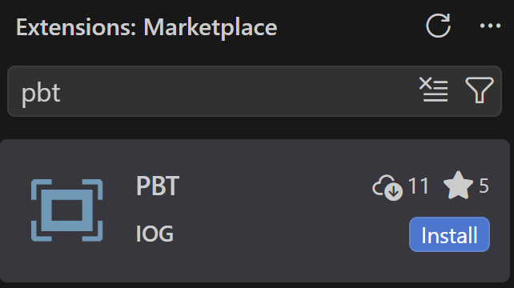
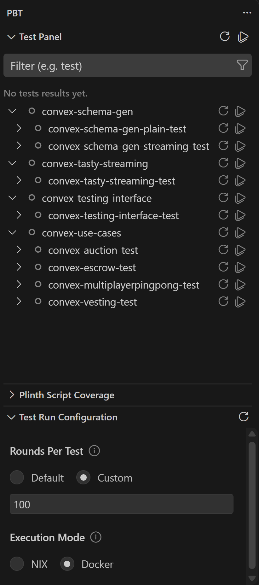
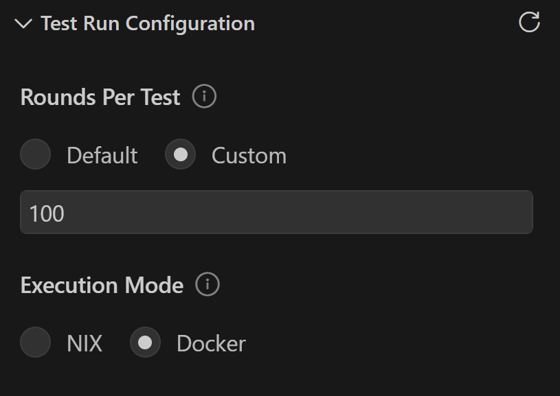
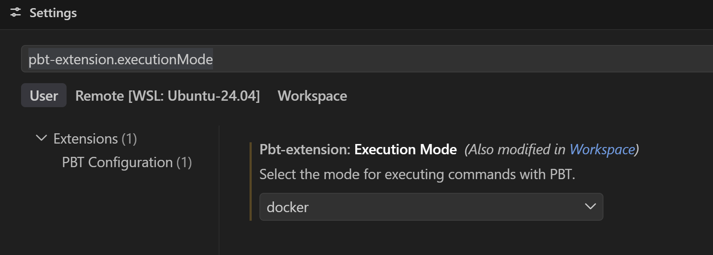

<p align="center">
  
</p>

<h1 align="center">PBT for VS Code</h1>

<p align="center">
  Run, explore, and debug property-based tests and threat models for Cardano smart contracts written in Plinth.
</p>

- [Overview](#overview)
- [Requirements](#requirements)
- [Getting started](#getting-started)
  - [1. Install the extension](#1-install-the-extension)
  - [2. Open your project](#2-open-your-project)
  - [3. Open the PBT sidebar](#3-open-the-pbt-sidebar)
  - [4. Choose an execution mode](#4-choose-an-execution-mode)
  - [5. Set the number of test rounds](#5-set-the-number-of-test-rounds)
  - [6. Run your tests](#6-run-your-tests)
  - [7. Read the results](#7-read-the-results)
- [Troubleshooting](#troubleshooting)

## Overview

Property-based testing finds the edge case you would never have thought to write a test for. PBT brings the entire property-based testing process into one seamless user interface.

- **Nothing to configure:** Write your test suites in your Haskell project as you normally would and PBT picks them up on its own. There is nothing to register on the extension side, no paths to point at, and no settings to keep in sync as the project grows.
- **One place to drive everything:** Run a whole package, a single suite, or one test, and watch status and timings arrive live while the test run is still running.
- **Round-level results:** See the status of every test at a glance, then open a test's result views to inspect the status of each of its rounds and the transactions inside them.
- **Transactions you can actually read:** An interactive graph of any round, with its inputs, outputs, fees, script addresses and datums laid out, plus an explorer for moving through a large round without losing your place.
- **Coverage where you are already looking:** See how much of each Plinth script a test run exercised, both as percentages in the sidebar and as highlighting on the lines of the script itself.

## Requirements

**Docker or Nix.** PBT runs your test suites using either Docker or Nix. you **MUST HAVE** one of them installed and working in order for the extension to run.

**Docker**: install Docker Desktop or Docker Engine and make sure it is actually running. 
**Nix**: install Nix. 

Whichever one you install is the one you tell PBT to use later, in [step 4](#4-choose-an-execution-mode).

**A working sc-testing-tools setup.** This extension is the front end. It does not run your tests itself. It launches your test suites and then reads the stream of events they report back, which is what fills in the test tree, the round results, the transaction graphs, and the coverage numbers. All of that comes from [sc-testing-tools](https://github.com/input-output-hk/sc-testing-tools), the testing backend PBT is built on top of.

If sc-testing-tools is not installed and working on your machine, PBT has nothing to run and nothing to display. To install the backend, follow the install instructions in the [sc-testing-tools README](https://github.com/input-output-hk/sc-testing-tools).

## Getting started

### 1. Install the extension

PBT is on the VS Code Marketplace. Open the Extensions view, search for `pbt`, and install the one published by **IOG**.



You can also install it from its [Marketplace page](https://marketplace.visualstudio.com/items?itemName=IOG.pbt-extension) in a browser, or from the command line:

```bash
code --install-extension IOG.pbt-extension
```

**Building from source.** If you would rather run a development build, clone the repository and compile it:

```bash
git clone https://github.com/input-output-hk/sc-testing-tools-vs-extension.git
cd sc-testing-tools-vs-extension
npm install
npm run compile
```

`npm run compile` builds the extension, the server, and the webview UI. Then press <kbd>F5</kbd> to launch a VS Code window with PBT loaded.


### 2. Open your project

PBT works on a Haskell/Plinth smart contract folder, so the first step is having that folder open in VS Code. Either open a workspace that already contains the folder, or open the folder in the workspace you are already in.

From there, PBT scans on its own. There is no command to run and nothing to configure.

The scan looks for `.cabal` files anywhere in your workspace, reads the test-suites declared in each one, and builds the test tree from what it finds:

```
Project_Package              a package, from one .cabal file
└── TestSuite1               a test-suite declared in that package
    └── Group1               a group of related tests
        └── Positive Tests   an individual test
```

Groups can sit inside other groups, so a suite that is organized in depth keeps that structure in the tree.

If the Test Panel tells you no test suites were found, the folder has nothing PBT can run. See [Troubleshooting](#no-test-suites-found-in-this-workspace).

### 3. Open the PBT sidebar

Click the PBT icon  in the Activity Bar to open the main extension interaction space. Clicking this icon gives you access to three seperate views.

| View | What it's for |
|---|---|
| **Test Panel** | The test tree, where you run tests and open additional views to inspect results |
| **Test Run Configuration** | Allows you to configure how a test run is performed |
| **Plinth Script Coverage** | Shows coverage results after a test run |



### 4. Choose an execution mode

Tell PBT which execution mode to run your tests with. The choice is stored in the `pbt-extension.executionMode` setting, which accepts `docker` or `nix` and defaults to `docker`. PBT saves it to your User settings, so the mode you pick applies to every VS Code session and every workspace until you change it again.

There are two ways to set it, and both write the same value.

**The Test Run Configuration view** in the PBT sidebar is the quickest way while you are working. Choose **NIX** or **Docker** under Execution Mode.



**The Settings editor** lists it under Extensions, PBT Configuration as **Pbt-extension: Execution Mode**. Searching for `pbt-extension.executionMode` takes you straight to it.



You can also add it to `settings.json` yourself:

```json
"pbt-extension.executionMode": "docker"
```

PBT checks that your selected mode is actually available at two points. It checks when the extension starts and when you open the PBT views, so a missing tool is reported before you try to run anything. It also checks again immediately before each test run, suite build, and tree refresh, because Docker can stop running at any time during a session. If the mode is unavailable at that moment, PBT reports the error and does not start the run.

Either way the error appears in the **Test Run Configuration** view. See [Troubleshooting](#docker-not-detected-nix-not-detected-or-problem-connecting-to-docker) for what each message means, and [this note](#the-mode-i-picked-is-not-the-mode-pbt-is-using) if the mode you picked does not seem to take effect.

### 5. Set the number of test rounds

A property-based test does not run just once. It generates many transaction rounds and checks your property against each one, the same way QuickCheck does. More rounds means a wider search for a counterexample and a longer run.

You control this in the **Test Run Configuration** view, under **Rounds Per Test**:

- **Default** uses the round count defined in your test suite.
- **Custom** lets you set the count yourself. The field starts at 100.

Lower the count for a quick check while you are iterating, and raise it when you want a more thorough search for edge cases.

