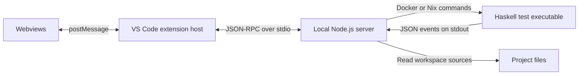
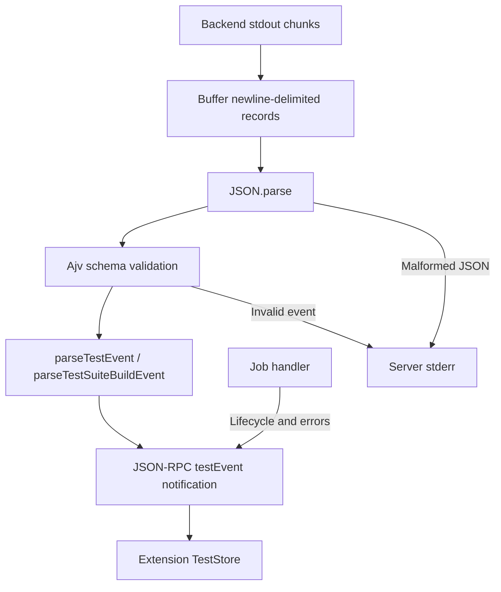
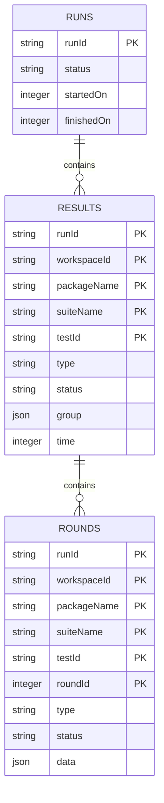
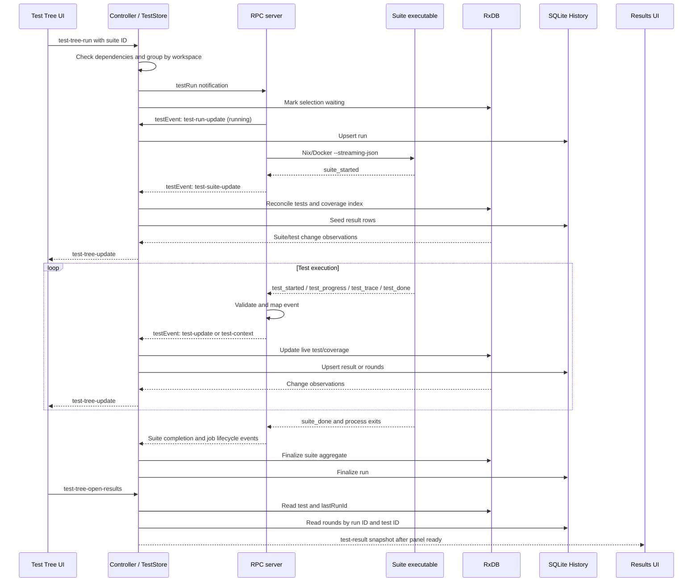

# PBT Extension Architecture

This guide is for developers and contributors working on PBT for VS Code. It describes the current implementation, its process boundaries, and how backend events become state and UI updates. For installation and user workflows, see [the user guide](../README.md).

- [System Overview](#system-overview)
- [Backend Context](#backend-context)
- [Server](#server): [discovery and execution](#discovery-and-backend-execution), [RPC](#rpc-contract-and-queue), [events](#event-pipeline), [errors and cancellation](#lifecycle-errors-and-cancellation)
- [Extension](#extension): [initialization](#initialization-and-ownership), [event processing](#teststore-event-processing), [RxDB](#in-memory-database), [refresh/reset](#refresh-and-reset-semantics), [SQLite](#sqlite-history), [coverage](#coverage-and-editor-integration), [settings](#settings-and-dependency-checks)
- [Webviews](#webviews): [shared infrastructure](#shared-infrastructure), [Test Tree](#test-tree), [Configuration](#test-run-configuration), [Coverage](#plinth-script-coverage), [Results](#test-results)
- [End-To-End Flow](#end-to-end-flow)
- [Contributor Guide](#contributor-guide)

## System Overview

PBT presents property-based tests and threat models for Cardano smart contracts written in Plinth. The extension discovers tests, starts builds and runs, and presents results, transaction graphs, and script coverage. Test generation, mockchain execution, contract validation, and property assertions belong to `sc-testing-tools`, not to the extension.

There are three implementation layers:

| Layer | Runs In | Responsibility | Entry Point |
| --- | --- | --- | --- |
| Server | A local Node.js child process | Discover suites, launch backend commands, validate and translate streaming events | [server/index.ts](../server/index.ts) |
| Extension | The VS Code extension host | Coordinate commands, stores, persistence, editor integration, and webview lifecycles | [src/extension.ts](../src/extension.ts) |
| Webviews | VS Code's isolated webview contexts | Render the test tree, configuration, coverage, and result panels; send user intents to the extension | [webview-ui](../webview-ui) |



Here, **server** means the bundled adapter process, not the Haskell backend and not an HTTP service. [src/services/rpcClient.ts](../src/services/rpcClient.ts) spawns `node out/server/index.js` and connects `vscode-jsonrpc` to its standard streams. No listening port is involved. The webviews do not call the server or execute backend commands directly.

The npm workspace builds these layers separately: `compile:extension`, `compile:server`, and `compile:webview`; `npm run compile` runs all three. [package.json](../package.json) also declares commands, sidebar views, startup activation, and the execution-mode setting. [shared/types.d.ts](../shared/types.d.ts) defines the common TypeScript data contracts.

## Backend Context

These repositories have different roles; the tutorial and playground are example projects to open in VS Code, not additional services that PBT starts:

| Repository | Role In The Architecture |
| --- | --- |
| [sc-testing-tools](https://github.com/input-output-hk/sc-testing-tools) | Haskell testing framework and command tooling used to build and execute suites and emit machine-readable events. |
| [sc-testing-tools-tutorial](https://github.com/input-output-hk/sc-testing-tools-tutorial) | Introduces `TestingInterface` through Ping-Pong and Auction examples: generated actions become transactions, execute on a mockchain, and are checked against model postconditions. |
| [sc-testing-tools-playground](https://github.com/input-output-hk/sc-testing-tools-playground) | Regression examples with normal and intentionally flipped threat-model assertions. Useful for checking passing and failing result presentation. |
| [sc-testing-tools-vs-extension](https://github.com/input-output-hk/sc-testing-tools-vs-extension) | This repository: the VS Code integration, local server adapter, and UI. |

A test **round** is a generated execution or attack attempt, not a separate test-tree leaf. The backend decides whether the property holds. In particular, the playground distinguishes claimed security (`threatModels`) from known vulnerabilities (`expectedVulnerabilities`): an accepted attack can be a failure of claimed security or an expected successful test outcome. UI code must not equate transaction validity with property-test success.

## Server

### Discovery And Backend Execution

There are two distinct discovery paths:

| Path | Implementation | Result |
| --- | --- | --- |
| Static prefetch | [server/services/prefetch/index.ts](../server/services/prefetch/index.ts), [discover.ts](../server/services/prefetch/discover.ts), and [buildList.ts](../server/services/prefetch/buildList.ts) | A fast, approximate `StaticTestTree` obtained by reading workspace files, without compiling or invoking Docker/Nix. |
| Suite build/list | [server/services/handler/testSuiteBuild.ts](../server/services/handler/testSuiteBuild.ts) | Compiles/launches the suite through Nix and requests `--list-tests-json`; its `suite_started` event supplies authoritative backend test IDs and the coverage index without running the tests. |

Static discovery scans Cabal packages, resolves ownership through root `cabal.project` files and their imports, and reads suite entry points and source directories. It excludes directories such as `.git`, `node_modules`, and `dist-newstyle`. The [static parser and extractors](../server/services/prefetch/static) use Tree-sitter Haskell, resolve source bindings/imports, and synthesize known `propRunActions` test structures. This is source analysis, not Haskell evaluation: dynamic expressions can become placeholders, some suites are skipped, and synthesized names/IDs need not match runtime discovery. Static tests therefore carry `isStatic: true` until reconciled with backend data. RPC tree maps are plain records, not JavaScript `Map` instances.

[server/utils/runScript.ts](../server/utils/runScript.ts) selects a Bash wrapper from [scripts](../scripts) according to `mode` and job type:

| Mode | List/Build | Run | Execution Environment |
| --- | --- | --- | --- |
| `nix` | [nix-list.sh](../scripts/nix-list.sh) | [nix-run.sh](../scripts/nix-run.sh) | `nix run <workspace>#<package>:test:<suite>` on the host. |
| `docker` | [docker-list.sh](../scripts/docker-list.sh) | [docker-run.sh](../scripts/docker-run.sh) | `nixos/nix` container, workspace mounted at `/project`, persistent `pbt-extension-nix-store` volume mounted at `/nix`; runs the same flake target inside the container. |

List commands pass `--list-tests-json`; run commands pass `--streaming-json` and optionally `--test-id <comma-separated IDs>`. Consequently, a project must expose the expected Nix test target and use a test entry point supporting the streaming reporter. Ordinary human-readable Tasty output is not the protocol. See the backend's [streaming integration and event documentation](https://github.com/input-output-hk/sc-testing-tools/blob/main/src/tasty-streaming/README.md). Docker mode still depends on Nix inside the container; it is not a separate backend implementation.

### RPC Contract And Queue

The [RPC client](../src/services/rpcClient.ts) and [server](../server/index.ts) communicate using `vscode-jsonrpc`, independently of the webview message protocol:

| Direction | Method | Kind | Payload / Response |
| --- | --- | --- | --- |
| Extension to server | `prefetch` | Request | `{ workspaces: Workspace[] }` returns `StaticTestTree`; failures become JSON-RPC `InternalError` responses. |
| Extension to server | `testSuiteBuild` | Notification | `{ mode, workspace, packageName, suiteName }`; enqueues one build job. |
| Extension to server | `testRun` | Notification | `{ mode, workspace, testIds: RunnableTestId[] }`; enqueues a run job for one workspace. |
| Extension to server | `stop` | Notification | No payload; removes queued jobs and sets the cooperative stop flag. |
| Server to extension | `testEvent` | Notification | `{ eventType, testJobId, payload }`; carries mapped backend events and server-generated job updates/errors. |

Build/run notifications do not return results. Their progress arrives through `testEvent`. `prefetch` is handled directly, outside the execution queue. The server uses `async.queue` with concurrency **1**, so build/run jobs are serialized. [handler/utils.ts](../server/services/handler/utils.ts) groups a run's selected IDs by package and suite; [handler/testRun.ts](../server/services/handler/testRun.ts) executes those suite commands sequentially within the job.

Identity matters at this boundary:

```text
Workspace       = { id, path }
TestPackageId   = [workspaceId, packageName]
TestSuiteId     = [workspaceId, packageName, suiteName]
TestId          = [workspaceId, packageName, suiteName, backendTestId]
RunnableTestId  = TestSuiteId | TestId
```

The final test ID component is a string representation of the backend ID. A three-element tuple selects an entire suite; a four-element tuple selects a test. `testJobId` identifies the server job, not a test or round. Several suites in one run job share that job ID. Do not reorder tuple components or use statically assigned leaf IDs as backend selectors.

The backend preserves original IDs when filtering, so they may be sparse. It can also include positive-test prerequisites when a threat-model test is selected. Consumers must use the IDs in events rather than assume the returned tests exactly match the selection or are numbered consecutively. Backend integration normally uses `Convex.Tasty.Streaming.defaultMainStreaming` (or its custom-ingredients variant) instead of plain Tasty `defaultMain`.

### Event Pipeline



1. `runScript` accumulates stdout across chunks, parses complete nonblank lines, and also handles a final record without a newline. It captures stdout/stderr for process errors.
2. [validateTestEvent.ts](../server/utils/validateTestEvent.ts) validates parsed objects with Ajv against [streaming-events.schema.json](../server/schemas/streaming-events.schema.json). [streaming-events.d.ts](../server/schemas/streaming-events.d.ts) supplies the backend TypeScript types. These are distinct from the extension's shared types.
3. [parseTestEvent.ts](../server/utils/parseTestEvent.ts) adds workspace/package/suite/job context and normalizes events into the extension model.
4. The job handler sends each mapped event as a `testEvent` notification. The extension then updates its own stores and emits a separate set of webview messages.

| Backend Event | Extension Event | Mapping |
| --- | --- | --- |
| `suite_started` during build/list | `test-suite-update` | `runStatus: "idle"`, complete non-static test list, and coverage index. Tests start undetermined and are not waiting. Other valid backend events are ignored by the build parser. |
| `suite_started` during a full-suite run | `test-suite-update` | `runStatus: "running"`, complete test list marked waiting, and coverage index. Backend group paths and source locations are retained. |
| `suite_started` during a selected-test run | `test-suite-update` | `runStatus: "running"`, but **no** `tests` or `coverageIndex`: the existing full suite must not be replaced by a filtered listing. |
| `suite_done` | `test-suite-update` | `runStatus: "done"`; suite aggregates are maintained in the extension. |
| `test_started` | `test-update` | Full test identity, `isRunning: true`, zero progress/time. |
| `test_progress` | `test-update` | Progress fraction becomes percentage via `percent * 100`. |
| `test_done` | `test-update` | `success` becomes `valid`/`invalid`; seconds become milliseconds via `duration * 1000`; a threat-model completion sets its test type. |
| `test_trace` | `test-context` | Context test identity/type, normalized transition and threat-model rounds, and per-test statement coverage. |

A trace produces one positive/negative `TransitionTestRound` and a `ThreatModelTestRound` for each distinct threat-model test ID represented in that trace. Multiple attacks for the same threat-model ID are grouped into its `traces` array. The round ID is the backend trace index, so it is only meaningful together with a test and run identity. Threat-model traces retain original/modified transactions, modifications, target transaction index, category, outcome, and optional validation details. Transaction normalization supplies output indices and adapts backend values to the UI's `Tx` shape.

[server/utils/coverage.ts](../server/utils/coverage.ts) converts backend source ranges to zero-based positions and keys statements as `startLine:startCol:endLine:endCol`. The suite coverage index records statements with empty test-ID arrays; trace coverage associates those statements with the tests that exercised them. Test source locations are also converted to zero-based coordinates for VS Code.

### Lifecycle, Errors, And Cancellation

| Server-Generated Event | Meaning |
| --- | --- |
| `test-run-update` | Job starts as `running`, then finishes as `success` or `failed`, with timestamps. `isLast` reflects whether there are queued jobs remaining when the update is emitted. |
| `test-run-error` | Command startup/exit failure with job, optional failing suite selection, script path, arguments, exit code, stderr, and stdout. Unknown exceptions are wrapped in the same shape. |

Job success describes command execution; individual test success comes from `test_done`. A suite process may emit useful results and still exit nonzero. In a multi-suite job, the handler reports a failed suite and continues with the remaining suites, then marks the job failed.

Malformed JSON lines are logged and skipped. Schema-invalid events raise `TestEventValidationError`, which the handler logs and skips; these do not themselves generate `test-run-error` or force the job to fail. A backend/schema mismatch can therefore leave partial UI data even when command execution completes. Keep the checked-in schema, backend type declarations, mapper, and shared types aligned when changing the protocol. The backend streaming README documents schema generation.

`stop` removes pending queue entries and sets a flag. The active handler checks that flag after each yielded parsed output, kills the child, and returns without sending a normal terminal job update; the flag is reset when the queue drains. Cancellation is therefore output-driven and is not guaranteed to interrupt a silent build immediately. The extension also clears its local running state when cancellation is requested.

Server stdout is reserved for JSON-RPC framing. Diagnostics belong on stderr; the client forwards stderr and verbose RPC traces to the **PBT Extension** output channel. `test-run-error` additionally drives an error notification and status-bar message through the RPC client.

## Extension

### Initialization And Ownership

[src/extension.ts](../src/extension.ts) creates a shared `PbtContext` containing the extension context, `Store`, four view controllers, output channel, and status-bar item. The manifest activates the extension on `onStartupFinished`. `Store.initialize` initializes settings, awaits the test store, then checks dependencies; only after that promise resolves are the four view controllers activated.

| Component | Owns |
| --- | --- |
| [Store](../src/services/store/index.ts) | The three stores below and their initialization order. |
| [TestStore](../src/services/store/testStore.ts) | RPC client, RxDB facade, SQLite history, ordered event processing, workspace identities, current job, tree expansion state, and coverage-tree projection. |
| [SettingStore](../src/services/store/settingStore.ts) | Execution mode, in-session round count, and VS Code coverage-bar thresholds. |
| [DependencyStore](../src/services/store/dependencyStore.ts) | Cached Docker/Nix availability, Docker daemon reachability, and dependency-error notifications to subscribers. |
| [View controllers](../src/modules) | VS Code commands, webview creation and message routing, and editor-facing actions. |

`TestStore` constructs the RPC child process and SQLite `History` object before its asynchronous initialization. It initializes RxDB and the RPC connection, registers event handlers, and installs workspace/editor listeners. The test tree is fetched lazily on the first `getTestTree()` call, normally when the Test Tree webview reports ready. Activation is therefore not the same thing as backend test execution.

Workspace IDs are the first eight hex characters of SHA-256 of the workspace folder's filesystem path. Moving a project changes its workspace identity. `runTest` groups selected IDs by workspace and sends one RPC run notification per workspace; the server then groups each job by package/suite.

### TestStore Event Processing

The server queue serializes **jobs**; the extension queue serializes **received events**. `TestStore` uses another `async.queue` with concurrency 1 so a suite listing is applied before later updates depend on those test records.

| Received Event | In-Memory Action | SQLite Action |
| --- | --- | --- |
| `test-suite-update` | Reconcile tests, coverage index, suite state, and `treeVersion`. | Seed/upsert result rows when a non-idle event includes a test list. Build/list events do not create run history. |
| `test-update` | Update status/progress/time; set `lastRunId = testJobId`; clear waiting/running flags as appropriate. | Read the current test from RxDB and upsert its result row. |
| `test-context` | Set positive/negative type and merge coverage. | Upsert context test metadata when a type is supplied, then persist every transition/threat-model round. |
| `test-run-update` | Publish the job through a `BehaviorSubject`. | Upsert `runs` for run jobs only, not build jobs. |
| `test-run-error` | Clear affected waiting/running state and mark failures. | No direct history write here; run lifecycle events supply job failure status. |

For events that touch both stores, RxDB is updated first and `History` second. These writes are not one cross-database transaction, and RxDB subscribers can react before the history write finishes. There is no persisted event log or replay mechanism. Do not treat a webview update as an acknowledgement that all history writes have completed.

The current job drives `pbt.activeTestRun`, which controls the title-bar run/refresh/cancel actions. `isLast` prevents a completed job from making the whole queue appear idle while another job is pending. Requesting stop sets the job subject to `null` and clears local waiting/running flags independently of backend termination.

### In-Memory Database

[src/services/database/index.ts](../src/services/database/index.ts) creates an RxDB database named `pbt` with `getRxStorageMemory()` and the update plugin. Its [collection schemas](../src/services/database/collections/schemas) describe the current workspace projection:

| Collection | Primary Identity | Contents |
| --- | --- | --- |
| `packages` | Colon-joined `TestPackageId` | Workspace path, package name, package source path. |
| `suites` | Colon-joined `TestSuiteId` | Status, waiting/running/static flags, elapsed test time, `treeVersion`. |
| `tests` | Colon-joined `TestId` | Name, group path, source location, type, status, progress, time, `lastRunId`. |
| `coverage` | SHA-256 of the resolved file path | File/context metadata, full statement index, and covered ranges with contributing test IDs. |

The database stores flat records. [src/utils/testTree.ts](../src/utils/testTree.ts) turns each test's `group` path into nested group nodes when a tree is fetched. Tree expansion state is supplied from `TestStore`'s plain in-memory maps, not from SQLite.

[Suite methods](../src/services/database/methods/suite.ts) compare backend listings with existing tests, replace static or changed test lists, and increment `treeVersion`. That version signals subscribers to rebuild the nested suite subtree, rather than sending only status fields. Suite completion computes status from child tests (`invalid` wins; all valid means valid; otherwise undetermined) and time as the sum of child test times, not wall-clock job duration.

[Test methods](../src/services/database/methods/test.ts) publish test updates through `tests.update$`; suite updates use `suites.update$`; coverage listens to inserts/updates on `coverage.$`. The controllers translate these observations into webview snapshots or patches. `hasCoverage` is derived when a test transitions out of running, rather than being a persisted test field.

### Refresh And Reset Semantics

`TestStore` debounces text-document changes and workspace-folder changes by **1 second**, serializing refreshes with RxJS `concatMap`. Prefetch still reads files from disk, not the editor's unsaved buffer. [refreshStaticTestTree](../src/services/database/methods/testTree.ts) removes absent packages/suites and recreates suites whose test count changed. Existing suites with the same count are retained, so automatic refresh is not a complete rename or source-location reconciliation.

The title-bar command named `pbt-extension.buildAllTestSuites` is presented as **Refresh Test Tree**, but its implementation builds/lists all currently known suites. `test-tree-fetch` obtains the current tree and only triggers initial prefetch when needed. Keep these operations distinct when changing refresh behavior.

**Clear all Results** resets suite/test status to `undetermined` and clears displayed times, then clears the current job. It does not delete SQLite history, coverage, test types, or `lastRunId`. **Cancel Test Run** clears waiting/running flags; it does not delete completed results or create a persisted cancellation status. Since the server's stop path has no terminal lifecycle event, a cancelled history run can remain recorded as running.

### SQLite History

[src/services/history/index.ts](../src/services/history/index.ts) opens **`~/.pbt/sqlite.db`** using Drizzle's `node-sqlite` adapter. The directory is created if absent, and the constructor applies generated migrations from [drizzle](../drizzle). This is a user-home database shared across workspaces, not workspace storage or an RxDB replication target. Runtime support for Node's SQLite API is required by this adapter.



The diagram shows the logical Drizzle relationships, not declared SQLite foreign-key constraints. [schema.ts](../src/services/history/schema.ts) defines the composite primary keys; [relations.ts](../src/services/history/relations.ts) defines query relations. `group` and round `data` are JSON encoded into text columns. Round `data` contains either transitions or threat-model traces, including transaction details. Coverage is not stored here.

History uses upserts: selected-test runs omit the full test list, so later test updates must be able to create result rows themselves. Run IDs distinguish repeated executions of the same test/round IDs. `getTestRunsHistory()` returns runs newest first; `getTestRoundsHistory(runId, testId)` queries a specific historical execution. These store APIs exist, but there is currently no run-history browser webview.

Opening a result calls `getTestResult(testId)`: read the live test from RxDB, then query SQLite by its `lastRunId` and full `TestId`. Without `lastRunId`, the panel gets an empty round list. Today that pointer is updated by `test-update`, not by `test-context` alone. Reloading VS Code recreates the live database and does not automatically hydrate previous statuses or last-run pointers from history, even though old SQLite rows remain.

Schema changes require `npm run db:generate` and the corresponding generated migrations alongside source changes. Updating Drizzle table declarations alone does not migrate an existing installation.

### Coverage And Editor Integration

[Coverage database methods](../src/services/database/methods/coverage.ts) resolve backend-relative file paths against the package path. Coverage statistics count unique indexed ranges and unique covered ranges, optionally filtered to a test. On a test's transition to running, its previous coverage associations are removed before new traces merge in. Other tests' associations remain, so the all-tests view represents accumulated current in-memory coverage, not an immutable historical run snapshot.

[src/utils/coverage.ts](../src/utils/coverage.ts) builds the package/suite/folder/file tree and creates covered/uncovered editor decorations. `TestStore` queries coverage when the active editor changes and removes decorations when that document is edited. The sidebar's single-test scope does not change this editor query: decorations use the file's aggregate coverage. Coverage documents are keyed by file path, not by run or `(suite, file)`, which matters when extending support for files shared across suites.

### Settings And Dependency Checks

Execution mode defaults to `docker`. `SettingStore` reads VS Code configuration at initialization and on external configuration changes, publishes mode changes through a `BehaviorSubject`, and writes sidebar changes at `ConfigurationTarget.Global`. It suppresses its own configuration-change echo to keep the just-selected in-memory mode. Workspace configuration can still affect the value read at initialization or on later external changes.

Coverage-bar thresholds come from `testing.coverageBarThresholds`, merged with `{ red: 0, yellow: 60, green: 90 }`. Round count starts at 100 and is held only in memory. **Current limitation:** neither `TestRunParams` nor the shell wrappers receive the stored round count, so changing it in the UI does not currently change backend execution.

Dependency checks run `docker --version`, `nix --version`, and, when Docker is present, `docker info` with a five-second response deadline. Before build/run actions, `TestTreeView` rechecks Docker installation/reachability in Docker mode; Nix availability remains cached until a full configuration refresh. Mode changes recompute the error from cached state. These guards live in the view controller, so a new direct caller of `TestStore.runTest` must account for dependency checking itself.

## Webviews

### Shared Infrastructure

The UI is React 19, built with Vite and Tailwind, with VS Code Elements controls, Codicons, and React Flow for transaction graphs. [webview-ui/vite.config.ts](../webview-ui/vite.config.ts) defines four HTML inputs and writes their bundles to [build](../build). The editable React roots live under [webview-ui/src/entrypoint](../webview-ui/src/entrypoint); generated assets are not the source of UI behavior.

| View | VS Code Identity | Placement | Extension Controller | React Root |
| --- | --- | --- | --- | --- |
| Test Tree | `pbt-test-tree` | Sidebar | [testTreeView.ts](../src/modules/testTreeView.ts) | [testTree/index.tsx](../webview-ui/src/webview/testTree/index.tsx) |
| Test Run Configuration | `pbt-test-run-configuration` | Sidebar | [testConfigurationView.ts](../src/modules/testConfigurationView.ts) | [testConfiguration/index.tsx](../webview-ui/src/webview/testConfiguration/index.tsx) |
| Plinth Script Coverage | `pbt-test-coverage` | Sidebar | [testCoverageView.ts](../src/modules/testCoverageView.ts) | [testCoverage/index.tsx](../webview-ui/src/webview/testCoverage/index.tsx) |
| Test Results | `pbt-test-result` | Reusable editor panel, initially column two | [testResultView.ts](../src/modules/testResultView.ts) | [testResult/index.tsx](../webview-ui/src/webview/testResult/index.tsx) |

[src/utils/webview.ts](../src/utils/webview.ts) implements the generic sidebar provider and `getWebviewHtml`. It enables scripts, restricts local resource roots to the extension directory, reads the built HTML, rewrites asset `src`/`href` attributes using `asWebviewUri`, and inserts a base URL for runtime-relative assets. The result panel uses the same HTML helper and enables `retainContextWhenHidden`.

Each React entry point calls `acquireVsCodeApi()` and passes that API into its root component. On mount, each root posts `webview-ready` and installs a `window` message listener; it removes the listener on unmount. The controller responds with the view's initial snapshot/configuration. Communication is asynchronous `postMessage`, not JSON-RPC: there are no request IDs or per-message acknowledgements.

[shared/types.d.ts](../shared/types.d.ts) defines `WebviewToExtensionMessage` and `ExtensionToWebviewMessage` as discriminated unions. The current handlers use TypeScript casts and switches, not runtime schema validation. Adding a type alone does not implement either sender or receiver. Keep privileged operations in the host and validate new user-controlled payloads there.

The tables below list messages in addition to the common **webview to extension** `webview-ready` message. Payload braces show the actual wire keys.

### Test Tree

The tree owns its displayed snapshot, active empty/error/tree state, current job display, and sort mode. It applies `test-tree-update` with [immutable tree update helpers](../webview-ui/src/webview/testTree/utils/treeUpdateUtils.ts). Text/type/status filtering, selection, context menus, and sorting are local presentation behavior. Group/package actions are expanded into suite/test selectors before being sent; selected leaves covered by a selected whole suite are removed from the outgoing selection.

| Direction | Message | Payload And Effect |
| --- | --- | --- |
| Host to UI | `test-tree` | `{ testTree }`: replace the complete snapshot and choose tree/empty state. |
| Host to UI | `test-tree-update` | `{ type: "test", test }` or `{ type: "suite", suite }`: merge a leaf or suite patch, including replacement subtrees. Patches require an existing tree. |
| Host to UI | `test-tree-test-run-update` | `{ job }`, where job may be `null`: update run/build progress and elapsed-time presentation. |
| Host to UI | `test-tree-set-sort` | `{ sortBy }`: set local `location` or `status` sorting. |
| Host to UI | `status-empty-workspaces` | No payload: show the open-folder state. |
| Host to UI | `test-tree-error` | No payload: show discovery error/retry state. Currently defined and consumed, but the controller's error-sending helper is not called by its fetch promise. |
| UI to host | `test-tree-fetch` | No payload: retry/request the current test tree. |
| UI to host | `test-tree-open-folder` | No payload: execute VS Code's `vscode.openFolder` command. |
| UI to host | `test-tree-run` | `{ testIds: RunnableTestId[] }`: dependency guard, then `TestStore.runTest`. |
| UI to host | `test-tree-build-suite` | `{ suiteId }`: dependency guard, then list/build the suite. |
| UI to host | `test-tree-open-results` | `{ testId }`: open or retarget the result panel. |
| UI to host | `test-tree-show-location` | `{ testId }`: resolve the source path and select/reveal its range in the editor. |
| UI to host | `test-tree-show-coverage` | `{ testId, testName, group }`: set single-test coverage scope and focus the coverage view. |
| UI to host | `test-tree-update-open-state` | `{ isOpen, workspaceId, packageName, suiteName?, path? }`: remember package/suite/group expansion in `TestStore`; the UI also updates immediately. |

Whole suites can be run while still static; individual test/group controls require runtime identities. UI filtering does not change backend discovery. Title-bar commands such as Run All, Cancel, Clear Results, Collapse All, and Sort are registered in the extension and do not require equivalent UI-to-host messages.

### Test Run Configuration

This view edits execution mode and the numeric round setting and displays dependency errors. On ready, the controller sends mode, rounds, and cached dependency status. Mode changes are observed through `SettingStore`; dependency changes flow through `DependencyStore` to both the view and status-bar/notification handling.

| Direction | Message | Payload And Effect |
| --- | --- | --- |
| Host to UI | `config-execution-mode` | `{ executionMode }`: set the selected Docker/Nix control. |
| Host to UI | `config-test-rounds` | `{ rounds }`: populate the numeric field. |
| Host to UI | `status-missing-dependency` | `{ error: { hasError, message, code? } }`: show or clear dependency errors; this message also represents the healthy state. |
| UI to host | `config-update-execution-mode` | `{ executionMode }`: update in-memory mode, persist the global setting, and recompute dependency status. |
| UI to host | `config-update-test-rounds` | `{ rounds }`: update the in-memory count only. |

The **Default/Custom** radio selection is local React state and only enables/disables the field; it is not sent to the extension or persisted. Together with the missing round-count forwarding described above, this means neither choice currently selects a different backend round policy. The title-bar refresh command reruns dependency checks; it does not reset test data.

### Plinth Script Coverage

The coverage view renders host-computed package/suite/folder/file totals, expansion state, and percentage bars. Its scope is either `{ type: "all" }` or `{ type: "test", testId, testName, group }`. The extension controller owns that scope; React renders the supplied scope and tree. Thresholds are distributed to rows through a React context.

| Direction | Message | Payload And Effect |
| --- | --- | --- |
| Host to UI | `coverage-tree` | `{ coverageTree, scope }`: replace the coverage snapshot and its title/scope. |
| Host to UI | `config-coverage-bar-thresholds` | `{ thresholds: { red, yellow, green } }`: update coverage-bar color thresholds from VS Code settings. |
| UI to host | `coverage-show-all` | No payload: reset scope to all tests and refetch coverage. |
| UI to host | `coverage-tree-update` | `{ isOpen, path: string[] }`: remember folder expansion state. Despite the name, this is not a coverage-data mutation. |
| UI to host | `coverage-open-file` | `{ filePath }`: open the source file in VS Code; the editor listener supplies decorations. |

All-tests scope receives live coverage updates. Single-test scope is fetched when selected and is not automatically republished for each coverage change. Collapse All clears the stored expansion flags and refetches. The title-bar close command resets scope and removes the coverage view; the in-view `coverage-show-all` action is the path that resets scope while keeping it visible.

### Test Results

The extension keeps one result panel. Opening another test reveals and retargets it instead of creating a panel per test. On first ready, or when retargeted, the controller fetches `{ test, rounds }` through `TestStore`. It observes updates for the selected test and only refreshes when its **status value changes**; transitions to `valid`/`invalid` trigger a SQLite round reload. It is not subscribed to every trace, and a rerun ending with the same status need not refresh an already-open panel. Reopening the result requests a new snapshot.

| Direction | Message | Payload And Effect |
| --- | --- | --- |
| Host to UI | `test-result` | `{ test, rounds }`: replace the selected test and its round data. |
| UI to host | `webview-ready` | The result panel's only outgoing protocol message. Table/graph interactions stay inside React. |

The panel has a common test header, a running/empty-round state, and two tabs:

| Surface | Internal Behavior |
| --- | --- |
| [Test rounds](../webview-ui/src/webview/testResult/components/TestRoundsView/index.tsx) | Sort rounds by ID; render transition or threat-model rows; summarize transactions, inputs, outputs, mints, and attacks. Local filters select failed/discarded rounds or mint transactions. Expandable subtables expose transaction data. |
| [Transaction Graph](../webview-ui/src/webview/testResult/components/TransactionGraphView/index.tsx) | Select a round, focus a transaction/UTxO, switch graph mode, navigate the graph explorer, and inspect node details. Table links switch tabs and invoke `showRoundNode` through a React ref; they do not ask the extension for more data. |
| [Attack timeline](../webview-ui/src/webview/testResult/components/TransactionGraphView/GraphTimeline.tsx) | For threat-model rounds, select an index in `round.traces`. Earlier traces show original transactions; the selected trace shows original/modified values; later traces are omitted. This is trace-by-trace inspection, not execution or replay of individual modifications. |

[reactFlowUtils.ts](../webview-ui/src/webview/testResult/utils/reactFlowUtils.ts) converts stored domain rounds into graph transactions, nodes, and edges, including current/previous values for changes. [Graph.tsx](../webview-ui/src/webview/testResult/components/TransactionGraphView/Graph.tsx) owns React Flow state, measured layout, collision handling, focus/fit behavior, minimap, and pan/zoom controls. None of this runs a contract or recomputes the backend property outcome.

## End-To-End Flow

This example follows a full-suite run after static discovery. Selected-test runs use the same path, but omit suite-list replacement as described in the server section.



RxDB observations and webview messages are asynchronous; the diagram groups them for readability rather than implying a transaction spanning live state, history, and UI.

## Contributor Guide

### Where To Change Behavior

| Change | Main Locations | Contract To Preserve |
| --- | --- | --- |
| Discover another Haskell test pattern | [server/services/prefetch](../server/services/prefetch) | Static discovery remains an approximation; backend IDs remain authoritative. |
| Change backend flags or execution environment | [scripts](../scripts), [runScript.ts](../server/utils/runScript.ts), and RPC parameter types | Keep Docker/Nix behavior aligned and stdout machine-readable. |
| Support a new backend event/field | [server/schemas](../server/schemas), [parseTestEvent.ts](../server/utils/parseTestEvent.ts), shared types, then `TestStore` handlers | Schema validation, coordinate/time conversions, and test/job identities must agree. |
| Change live tree/status behavior | [database methods](../src/services/database/methods), [testStore.ts](../src/services/store/testStore.ts), tree update helpers | Preserve ordered events, suite `treeVersion`, and initial snapshot before patches. |
| Persist new history data | [history](../src/services/history), [drizzle](../drizzle) | Update schema, migrations, writers, and readers; retain composite identity. |
| Add a webview action | [shared/types.d.ts](../shared/types.d.ts), relevant [controller](../src/modules), and [React view](../webview-ui/src/webview) | Implement both sender and receiver; keep backend/filesystem access in the host. |
| Change graph presentation | [TransactionGraphView](../webview-ui/src/webview/testResult/components/TransactionGraphView), [result utilities](../webview-ui/src/webview/testResult/utils) | Graph validity, round status, and property-test success are different concepts. |

### Build And Verification

From the repository root, `npm install` installs the npm workspaces and `npm run compile` builds all three layers. Narrow commands are `npm run compile:extension`, `npm run compile:server`, and `npm run compile:webview`. The UI also exposes `npm run lint -w webview-ui`. Use the repository's VS Code launch configuration with F5 to exercise host APIs and real webview messaging; a standalone Vite page does not provide `acquireVsCodeApi()` by itself.

For changes crossing layers, exercise static discovery, compiled listing, a full-suite run, and a selected-test run. Check that IDs still line up, completion clears running state, result rounds can be reopened, and aggregate/single-test coverage behaves as expected. Include a failing suite and cancellation when changing lifecycle handling. The tutorial supplies small integration examples; the playground's normal/flipped suites exercise the distinction between expected vulnerabilities and failed security claims. These are suggested integration scenarios, not tests automatically run by `npm run compile`.

For debugging, start with **PBT Extension** output: it contains RPC traffic, server diagnostics, and captured command failure output. Follow the relevant identity (`testJobId`, full `TestId`, round ID) across the mapper, store, and history lookup. Logs and persisted transaction details may contain project data; remove sensitive information before sharing them, as described in [CONTRIBUTING.md](../CONTRIBUTING.md).

Subscriptions and processes have different lifetimes. Sidebar webviews can be disposed and resolved again; settings/threshold subscriptions already demonstrate per-view cleanup. Other store subscriptions do not consistently expose disposal, and `deactivate()` is currently empty with no explicit RPC child/database shutdown. When adding long-lived resources, wire cleanup to the appropriate view or extension lifecycle rather than assuming all existing resources are centrally disposed.
